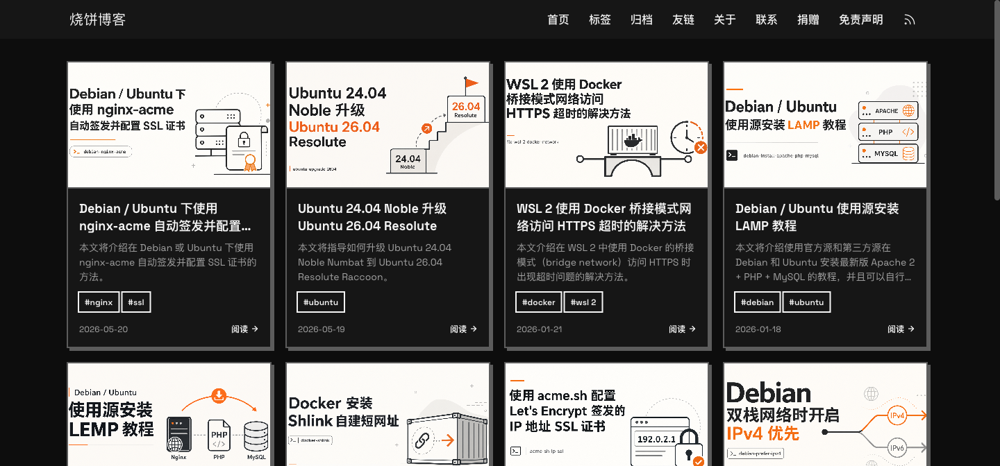
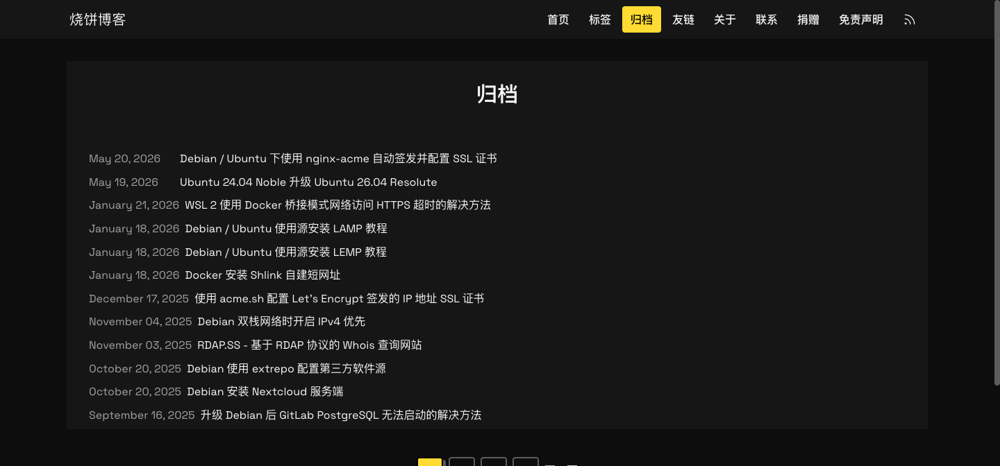
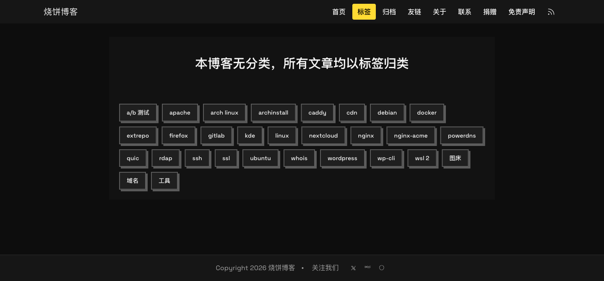

# USB — 一款 Hexo 主题

> 像素级复刻 [u.sb（烧饼博客）](https://u.sb) 设计风格的 Hexo 主题。



## ✨ 核心特性

### 像素级还原 u.sb 风格

从 `#0d0d0d` → `#121212` → `#1a1a1a` 的三段式深色配色方案，搭配 `#ffdb33` 黄色强调色点睛。每个细节都与原站逐项对齐验证。



### 硬边设计语言

- **0px 圆角** —— 全站无圆角，贯彻硬边美学
- **硬边阴影** —— `rgb(92, 92, 92) 4px 4px 0px 0px`，无模糊、零偏移
- **纯黑底色** —— 四层背景色（`#0d0d0d` / `#121212` / `#1a1a1a` / `#161616`）靠明暗对比区分区域，不用边框

### 文章页三段式结构

```
┌─────────────────────────────┐
│  .post-article      #121212 │  正文（标题/元信息/正文）
├─────────────────────────────┤
│  .post-footer-card  #1a1a1a │  标题/URL/作者/版权元信息
├─────────────────────────────┤
│  .post-footer-tags  #121212 │  标签区
└─────────────────────────────┘
```

宽度统一控制在 `920px`，居中显示。


### 响应式文章卡片网格

| 断点 | 列数 | 设备 |
|------|------|------|
| `< 640px` | 1 列 | 手机 |
| `640px – 768px` | 2 列 | 平板 |
| `768px – 1280px` | 3 列 | 小屏桌面 |
| `≥ 1280px` | 4 列 | 大屏桌面 |

### 文章目录（TOC）抽屉

文章页自动解析 `h2`/`h3` 生成目录，点击侧边按钮弹出抽屉面板，支持锚点平滑滚动和 ESC 关闭。

### 代码块 Copy 按钮

自动为所有代码块（highlight.js 渲染）注入复制按钮，支持一键复制，附带 `figure.highlight` 模式的 fallback 处理。

### 灵活的配置系统

所有主题配置集中在 `themes/usb/_config.yml`：

- 导航菜单项
- 社交链接（GitHub、Twitter 等）
- 页面显示开关（封面图、摘要、每页文章数）
- 强调色自定义

### 内置常用页面

归档页、标签页、关于页、友链页、免责声明页，覆盖博客全部常用场景。



## 🎨 视觉规范

### 配色方案

| 变量 | 颜色 | 用途 |
|------|------|------|
| `--background` | `#0d0d0d` | 页面底色 |
| `--card` | `#161616` | Header / 卡片 |
| `--border` | `#5c5c5c` | 边框色 |
| `--primary` | `#ffdb33` | 强调色（黄） |
| `.post-article` | `#121212` | 正文区 |
| `.post-footer-card` | `#1a1a1a` | 元信息卡片 |

### 字体与排版

- **英文字体**：Space Grotesk
- **中文字体**：PingFang SC → Microsoft YaHei
- **Header 高度**：固定 `56px`
- **通用容器宽度**：`1280px`
- **文章正文宽度**：`920px`

## 📦 安装

1. 将主题克隆到 Hexo 站点的 `themes/` 目录：

```bash
git clone https://github.com/jarodvip/hexo-usb-themes.git themes/usb
```

2. 修改 Hexo 站点配置文件 `_config.yml`，将主题设为 `usb`：

```yaml
theme: usb
```

3. 清缓存并启动：

```bash
hexo clean && hexo generate && hexo server
```

## 📁 文件结构

```
themes/usb/
├── _config.yml                # 主题配置：菜单、社交、强调色等
├── layout/
│   ├── layout.ejs             # 主布局：HTML head/body、partial 装配
│   ├── index.ejs              # 首页：文章卡片网格 + 分页器
│   ├── post.ejs               # 文章页：三段式结构
│   ├── page.ejs               # 独立页面
│   ├── archive.ejs            # 归档页
│   ├── tag.ejs                # 标签页
│   └── partials/
│       ├── header.ejs         # 顶部导航栏
│       ├── footer.ejs         # 页脚 + 社交链接
│       ├── back-to-top.ejs    # 回到顶部按钮
│       └── toc.ejs            # 目录抽屉
└── source/
    ├── css/style.css          # 完整样式（~1100 行，CSS 变量见 :root）
    └── js/main.js             # 代码块 Copy / TOC 抽屉 / 版权年份
```

---

> 用 ❤️ 打造，献给喜欢干净、深色、硬边风格博客的你。
